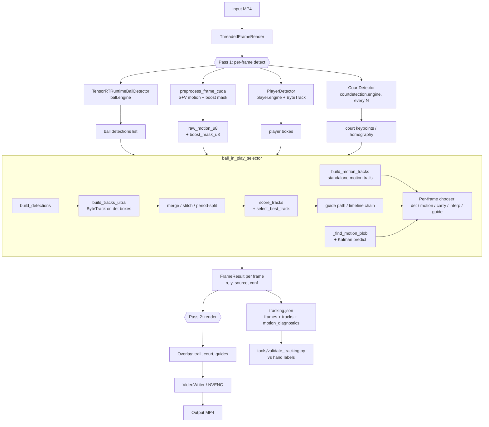

# CLAUDE.md — Triton Tennis Tracker

Single-source orientation doc for any future Claude session in this repo. Read this first; cross-reference `TENNIS_TRACKING_ROADMAP.md` for current decisions and priority order.

---

## 1. Product purpose

A **single-camera 2D tennis tracker**. Ingests a tennis match video; produces:

- per-frame ball location with provenance (`det`, `motion`, `carry`, `interp`, `guide`)
- player tracks (BoT/ByteTrack on TensorRT YOLO)
- court keypoints (homography for court-plane projection)
- a rendered overlay video and a `tracking.json` with full diagnostics

**Phase 2 goal** (deferred until 2D is solid): single-camera 3D ball flight, hit speed, bounce location, and player foot position — i.e., a Hawk-Eye-style ecosystem on consumer video, no multi-camera rig.

---

## 2. Architecture — high-level layers

This is a **single-process Python video pipeline**. No services, no API, no database.

| Layer | Package | Role |
|---|---|---|
| **Orchestrator** | `now_main_pkg/app.py` (~2,323 LoC) | CLI, two-pass orchestration, JSON export, threading, output assembly |
| **Perception** | `now_main_pkg/detectors.py`, `motion.py`, `tracking.py` | TensorRT YOLO ball/player/court + CUDA S+V motion mask + ROI motion tracker |
| **Decision (the brain)** | `ball_in_play_selector/` (~5,700 LoC total) | Builds detection tracks, scores them, picks "the ball" using physics + court gating |
| **I/O & render** | `now_main_pkg/video_io.py`, `rendering.py` | Threaded reader, NVENC writer, overlay drawing |

### Critical architectural observation

**Three competing signal sources fight inside the selector** every frame: YOLO detections (`det`), motion blobs (`motion`), and Kalman-projected carry (`carry`). The selector also pre-builds a best-track over the whole clip and uses it as a soft "guide" constraint at frame time. This is where the complexity lives. Every roadmap item §2–§8 is essentially "untangle this layer."

---

## 3. Code map

### Directories (real ones)

```
triton_tennis-main/
├── now_main.py                       # thin entry → now_main_pkg.app.main()
├── now_main_pkg/                     # ORCHESTRATOR + perception adapters
│   ├── app.py                        # ~2,323 LoC — pass1 detect, pass2 render, JSON export
│   ├── config.py                     # @dataclass Config (paths, knobs)
│   ├── detectors.py                  # TensorRTRuntimeBallDetector, PlayerDetector (ByteTrack/BoT), CourtDetector
│   ├── motion.py                     # CUDA S+V motion, boost-mask CC filter, protect masks
│   ├── tracking.py                   # ROITrack (per-frame ROI bookkeeping)
│   ├── rendering.py                  # trail / court / guide overlays, NVENC paths
│   ├── video_io.py                   # ThreadedFrameReader, pinned uploader, async VideoWriter
│   └── utils.py                      # engine path / device resolution
├── ball_in_play_selector/            # THE BRAIN
│   ├── core.py                       # ~2,984 LoC — per-frame ball decision, gates, search, latching
│   ├── tracking.py                   # ~1,352 LoC — Ultra/Greedy track builders, motion tracks, stitching
│   ├── scoring.py                    # ~660 LoC — score_tracks, timeline chain, period split
│   ├── physics.py                    # ~275 LoC — BallKalmanFilter, gravity+drag projectile, court homography
│   ├── models.py                     # Detection, MotionTrack, Track, FrameResult dataclasses
│   ├── config.py                     # SelectorConfig — auto-scaled from fps/diag (~100 knobs)
│   └── utils.py                      # homography helpers, mask helpers
├── mini_court/                       # plan-view rendering helper
├── trajectory_smoother.py            # legacy smoother (not imported by app.py — likely dead)
├── tools/
│   ├── run_gridtracknet_onnx.py      # external baseline (TF→ONNX, runs in separate env)
│   └── validate_tracking.py          # JSON vs hand labels (already implemented end-to-end)
├── validation/                       # annotations / fixtures / reports
├── Trt_/trt_engine_builder.py        # .pt → .engine builder
├── models/                           # ball.{pt,onnx,engine}, player.*, courtdetection.*
├── input_videos/ output_videos/
└── TENNIS_TRACKING_ROADMAP.md        # priority order — accurate, follow it
```

### Public contract — `tracking.json`

This is the **only** stable interface the pipeline emits. Schema:

```
{
  "summary": { ... },
  "frames": [
    { "frame": int, "present": bool, "x": float, "y": float, "conf": float,
      "source": "det"|"motion"|"carry"|"interp"|"guide", "bbox": [..],
      "search": {..}, "guide_search": {..} }
  ],
  "tracks": [
    { "track_id": int, "score": float, "num_obs": int, "span": int,
      "first_frame": int, "last_obs_frame": int, "score_breakdown": {..},
      "observations": [..] }
  ],
  "motion_diagnostics": { "summary": {"reason_counts": {..}}, "frames": [..] }
}
```

Every measurement, comparison, and downstream tool (validation, GridTrackNet A/B, future 3D) consumes this.

### External dependencies

- **PyTorch 2.2 + CUDA 11.8**, **TensorRT** (direct runtime, not Ultralytics)
- **OpenCV 4.9** (CPU + cuda where available), **NumPy 1.26**, **SciPy** (only for interp)
- **filterpy** — `KalmanFilter` for ball state
- **Ultralytics 8.1.29** — used as *tracker* in selector (`bytetrack` mode), not as detector
- **boxmot** — `ByteTrack` for player tracking
- **ffmpeg / NVENC** — output encoding (per roadmap: ffmpeg discovery currently broken on Windows)
- **GridTrackNet (ONNX)** — external baseline under evaluation in a separate `gridtracknet` conda env

### Interfaces / seams

The only swappable seam is `BallDetectorBackend` in `now_main_pkg/detectors.py` (`detect`, `detect_async_start/finish`, `supports_cuda_frame`). Stage 3 of the current plan adds a `GridTrackNetBackend` here once validation is in place.

### In-memory "data models" (no persistence)

`Detection`, `Track`, `MotionTrack`, `FrameResult`, `ROITrack`, `BallKalmanFilter`.

---

## 4. Mermaid data flow



---

## 5. Complexity hotspots (where work hurts the most)

1. **`ball_in_play_selector/core.py` (2,984 LoC) does six jobs at once**: candidate generation, association, KF state update, track scoring, source selection (det/motion/carry/interp/guide), and interp/render shaping. They share state — that's why "loosen tiny motion blobs" caused vertical spikes when shipped. Roadmap §8 calls for splitting this.
2. **Three coexisting track builders**: `build_tracks_ultra` (ByteTrack), `build_tracks` (greedy), `build_motion_tracks` (standalone motion trails). One should be the production path.
3. **Two motion systems historically existed**: the production CUDA S+V path in `motion.py`, and the now-archived 1,469-LoC `motion_temporal_experiment.py` (moved out of repo to Desktop — roadmap explicitly says do not merge).

---

## 6. Strategic findings — what the literature says (May 2026)

Decisions on what to add/replace must be grounded in these, not vibes:

| System | What it does | Why it matters here |
|---|---|---|
| **WASB-SBDT** (BMVC 2023, NTT) — *Widely Applicable Strong Baseline for Sports Ball Detection and Tracking* | High-resolution feature extraction + position-aware training + temporal-consistency inference. **Beats 6 SOTA SBDT methods including TrackNetV2 on 5 sports including tennis.** | The proper "TrackNet upgrade." If a heatmap detector is ever swapped in as the primary, this is the target, not GridTrackNet. |
| **TrackNetV3** (2024–2025) | Adds trajectory **inpainting + rectification** on top of TrackNetV2; near-perfect recall on tennis/badminton/table tennis. | Solves the "orange disconnect during YOLO gaps" problem — but it does so as a *post-process on a track*, not as a per-frame detector. |
| **GridTrackNet** (local test, this repo) | 5-frame temporal input → 5-frame output, 768×432 ONNX. | Local measurement: thr 0.9 → 0 large jumps, 232 fps inference, 58.6 fps end-to-end standalone. **Independent of YOLO**, so OR-ing the two sources lifts recall without adding jumps. Good candidate for a second `BallDetectorBackend`. |
| **TT3D** (CVPR 2025 W) + **"Where Is The Ball"** (Jun 2025) + **"Uplifting Table Tennis"** (Nov 2025) | Physics-constrained 3D ball reconstruction from a **single monocular camera**, using flight ODE + bounce constraints. TT3D explicitly says depth regression fails because the ball is ≤ 10 px. | The "multi-camera required for 3D" assumption is **partially obsolete**. Single-camera 3D is a published reality for table tennis; the same ODE + bounce method applies to tennis. This is the Phase 2 target. |
| **BlurBall** (Sep 2025) | Joint ball + motion-blur estimation — uses streak shape to recover position and direction. | Direct fit for streak frames where YOLO misses and the motion mask shows elongated blobs. |
| **ByteTrack** (arXiv 2110.06864) | Associates **low-confidence** detections, not just high-confidence ones. | Already informs roadmap §5. The selector should keep low-conf YOLO boxes as secondary candidates gated by physics. |

### Locally measured baseline (from the roadmap)

- Video: 2022 frames, 1920×1080, 59.7 fps.
- End-to-end runtime: 107.9 s → **18.7 fps effective**.
- Filled tracking frames: 684 / 2022 = **33.8%**.
- Tracks built: 39. Source mix: `det` 504, `motion` 90, `carry` 90. Large jumps over 120 px: **0**.
- Main bottlenecks: player/court aux 35.7 s, ball detect 26.4 s, preprocess/motion 22.5 s.
- ffmpeg not found → NVENC disabled → output writing slower than it should be.

The story these numbers tell: **precision is fine, recall is the problem.** A detector swap helps recall on hard frames; the selector tangle wastes recall that's already there. Both are worth doing, but only after measurement.

---

## 7. Recommended direction — matches roadmap

In strict order:

1. **Validation loop** (roadmap §1) — every later change must be A/B-able through `tracking.json` + `tools/validate_tracking.py`. Orchestrator and report-diff tools live under `tools/`.
2. **Motion diagnostics** (roadmap §2) — `motion_diagnostics` in JSON, already wired; use it.
3. **Structured motion candidates → orange-to-track connection** (roadmap §3–§4) — fix the `carry`-dominates-when-motion-exists pathology.
4. **Low-confidence detection recovery** (roadmap §5) — ByteTrack-style secondary association.
5. **Detector supplement, not swap** (roadmap §10) — wire GridTrackNet ONNX at threshold ≥ 0.9 as a second `BallDetectorBackend`. Only after §1 exists so the gain is measurable. WASB-SBDT is the longer-horizon target if a heatmap detector ever becomes primary.
6. **`core.py` decomposition** (roadmap §8) — split into candidate gen / association / state / scoring / source selection / interp. Behavior-preserving first.
7. **3D ecosystem** (roadmap §11) — TT3D-style physics-constrained monocular reconstruction. Single camera, no rig. Gate: 2D fill rate > 80% and pixel-error p50 < 6 px on the labeled set.

### What NOT to do

- Do **not** replace YOLO with motion-only — every modern SOTA (WASB, TrackNetV3, YOLO-Ball 2026, YOLO+Siamese-Kalman) is detection + temporal/motion, never motion alone.
- Do **not** rewrite TrackNet as a motion detector — it is a *heatmap ball detector*, peer of YOLO, not peer of the motion mask.
- Do **not** plan multi-camera 3D as Phase 2 — published 2025 work shows monocular + physics is sufficient for table tennis; tennis has the same physics.
- Do **not** merge `motion_temporal_experiment.py` back into the main path — roadmap says so, and it's been archived.

---

## 8. Sources

- WASB-SBDT (BMVC 2023): https://arxiv.org/abs/2311.05237
- WASB-SBDT repo: https://github.com/nttcom/WASB-SBDT
- TrackNet (arXiv 1907.03698): https://arxiv.org/abs/1907.03698
- TrackNetV3 + trajectory rectification (ScienceDirect 2025): https://www.sciencedirect.com/science/article/pii/S1877050925016709
- TT3D (CVPR 2025 W): https://openaccess.thecvf.com/content/CVPR2025W/CVSPORTS/papers/Gossard_TT3D_Table_Tennis_3D_Reconstruction_CVPRW_2025_paper.pdf
- TT3D project page: https://cogsys-tuebingen.github.io/tt3d/
- "Where Is The Ball: 3D from 2D Monocular" (Jun 2025): https://arxiv.org/html/2506.05763v1
- "Uplifting Table Tennis" (Nov 2025): https://arxiv.org/html/2511.20250
- BlurBall (Sep 2025): https://arxiv.org/html/2509.18387v1
- ByteTrack (arXiv 2110.06864): https://arxiv.org/abs/2110.06864
- GMP frame-difference table tennis (Nature Sci Reports 2024): https://www.nature.com/articles/s41598-024-80056-3
- YOLO-Ball + FTOC (Sage 2026): https://journals.sagepub.com/doi/10.1177/17543371261423768

---

## 9. Conventions for future sessions in this repo

- **Don't touch `now_main_pkg/`, `ball_in_play_selector/`, detectors, or motion logic without an A/B in `validation/reports/`.** Every behavior change must produce a before/after report. This is the rule that turns the project from flailing into engineering.
- **`tracking.json` is the source of truth.** Don't add side channels for debug output — extend the JSON schema.
- **One-shot loop:** `python tools/run_validation.py --clip pomona_baseline` and `python tools/compare_reports.py --before <a> --after <b>`.
- **Bootstrapping labels:** `python tools/extract_label_frames.py --tracking-json <tj> --video <mp4> --out-dir validation/labels/<clip>/ --n-frames 80` writes 80 high-value PNGs plus a starter annotation JSON pre-filled with the pipeline's (x, y) so labeling is correct-don't-create. Then `python tools/label_assist.py --starter <starter.json> --frames-dir <dir> --out validation/annotations/<clip>.json` opens a cv2 click labeler — yellow crosshair is the pre-fill, click to set red label, `v` to mark not-visible, `n`/`p` to navigate, `q` to save+quit.
- **Don't reintroduce dead code paths.** If something is "experimental," it lives outside the repo until it earns its way back in via the validation loop.
- **CUDA is required.** TensorRT runtime, CUDA motion preprocessing, pinned-memory uploads — none of it has a graceful CPU fallback in production paths.
- **Windows host.** PowerShell is the primary shell. Bash works for POSIX scripts via the Bash tool but treat path separators carefully.
