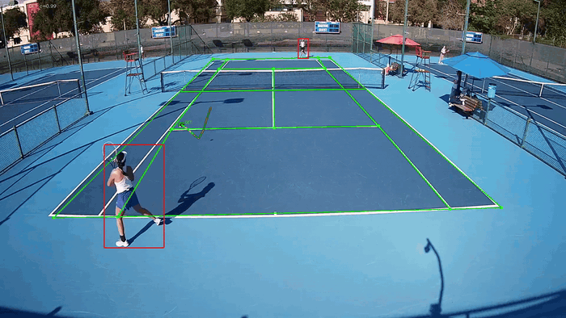

# Triton Ball Tennis

A GPU tennis-video tracker built around GridTrackNet temporal ball detection,
TensorRT player and court detection, and conservative motion/physics recovery.
It produces an annotated MP4 and per-frame tracking JSON.

## Demo

[](media/tracking_demo.mp4)

The overlay distinguishes where each selected point came from:

- **Green (`DET`):** raw GridTrackNet detection
- **Orange (`MOT`):** motion-supported recovery
- **Cyan (`PHY`):** short bounded interpolation or physics recovery

Raw green detections are preserved. Recovery is deliberately conservative: an
unresolved detector gap remains a gap instead of becoming a long predicted path.

## Pipeline

- GridTrackNet runs on raw RGB frames in five-frame temporal units at its native
  30 FPS cadence (30 or 60 FPS input is supported).
- Player and court models run through TensorRT.
- Motion masks support selection and short recovery but are not used to alter
  GridTrackNet's input.
- The ball-in-play selector rejects static objects and implausible track switches,
  closes safe one-frame holes, and exports the selected source for every frame.
- The renderer draws a short anti-aliased trail without inventing points across
  lost sections.

## Requirements

- Python 3.10
- NVIDIA CUDA GPU
- CUDA-enabled PyTorch
- TensorRT 10
- OpenCV and NumPy
- FFmpeg recommended for faster video encoding

The repository includes the GridTrackNet weight export and TensorRT engines used
by the default pipeline. TensorRT engines are platform-specific and may need to
be rebuilt for a different GPU or TensorRT version.

## Usage

Run the bundled Pomona sample:

```powershell
python clean_tracker.py
```

Run another 30 or 60 FPS match:

```powershell
python clean_tracker.py --input path\to\match.mp4 --output output\tracking.mp4 --tracking-json output\tracking.json
```

Export JSON without rendering a video:

```powershell
python clean_tracker.py --input path\to\match.mp4 --tracking-json output\tracking.json --no-video
```

Use another CUDA device or detector threshold:

```powershell
python clean_tracker.py --device 1 --conf 0.55
```

## Fine-tuning GridTrackNet

The bundled GridTrackNet weights contain the latest fine-tuned checkpoint used
to produce the demo.

## Validation

Run the deterministic tracking checks:

```powershell
python clean_tracker.py --self-test
```

Evaluate against annotations:

```powershell
python clean_tracker.py --no-video --annotations sample\pomona_annotations.json
```

## Project structure

```text
clean_tracker.py                         Command-line entry point
tennis_tracker/gridtracknet.py           GridTrackNet model and decoder
tennis_tracker/                          Detection, motion, rendering, and video pipeline
ball_in_play_selector/                   Track construction, scoring, and recovery
models/gridtracknet_weights_torch.npz    GridTrackNet inference weights
models/                                  Player and court TensorRT engines
sample/                                  Sample videos and validation annotations
output/                                  Generated videos, JSON, and reports (ignored)
```

## Current limitation

GridTrackNet can still miss a blurred ball or select a player/background feature.
The conservative selector prevents many false continuations, but correcting raw
green detector errors requires fine-tuning the model on additional labeled clips.
